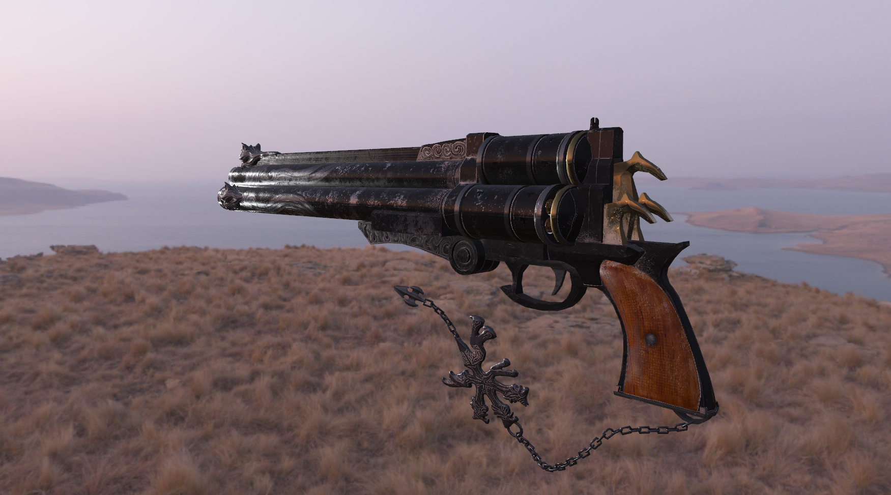

# Windmill
A real-time renderer featuring deferred shading, PBR, IBL, soft shadow with PCF, and MSAA

## Examples


## Features
- Physically based rendering
- Deferred shading
- Image-based lighting
- Soft shadow with percentage-closer filtering
- Multisample Anti-Aliasing
- Tone mapping
- Gamma Correction

## Prerequisites
* Windows 11 version 25H2
* [Visual Studio 2022](https://visualstudio.microsoft.com/zh-hant/downloads/) or newer
* [Vulkan SDK 1.4](https://vulkan.lunarg.com/) or newer
* [CMake 3.3](https://cmake.org/) or newer

## Building
### Windows 
1. Clone the repository.
```
git clone --recursive https://github.com/lanwenzhang/Windmill.git
```
2. Open Visual Studio 2022.
3. Go to **File > Open > Folder...** and open the project root folder `Windmill`, which contains `CMakeLists.txt`.
4. Wait for Visual Studio to finish configuring the CMake project.
5. Select a build configuration as `x64-Debug` and `Build`.
6. Set the main executable target as the `Startup Item` and press `F5` to run.

## Usage
* `W`/`A`/`S`/`D` - camera movement
* `RMB` - hold to look around

## Reference
### Third-party library
* [assimp](https://github.com/assimp/assimp)
* [glfw](https://github.com/glfw/glfw)
* [glm](https://github.com/g-truc/glm)
* [imgui](https://github.com/ocornut/imgui)
* [tinyexr](https://github.com/syoyo/tinyexr)

### Open source code
* [LearnOpenGL](https://github.com/JoeyDeVries/learnopengl)
* [Piccolo](https://github.com/BoomingTech/Piccolo)

### Assets
* [Andrew Maximov](https://artisaverb.info/PBT.html)
* [Poly Haven](https://polyhaven.com/hdris)

